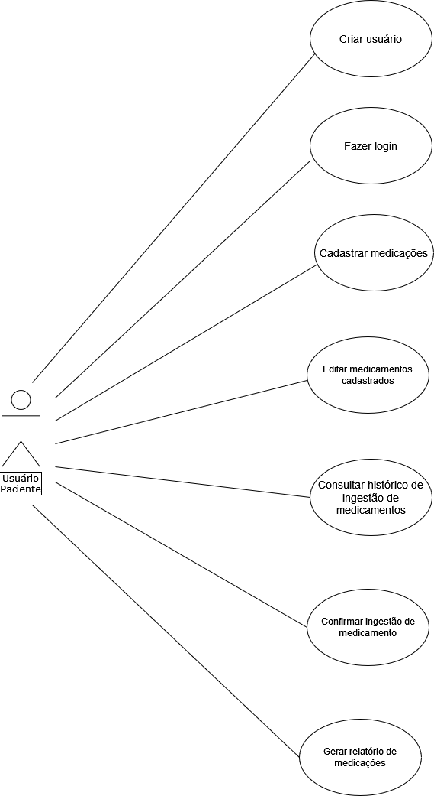
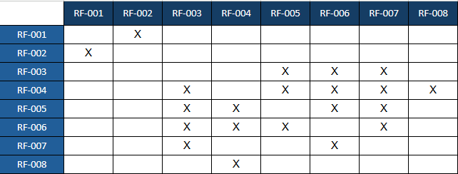
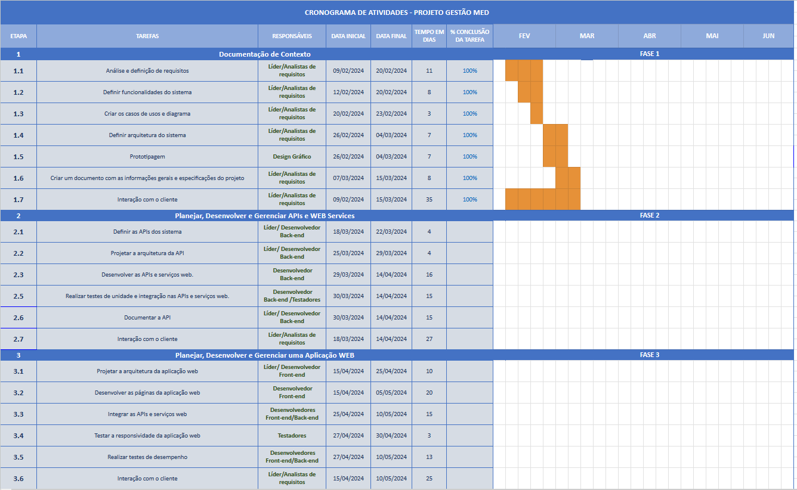
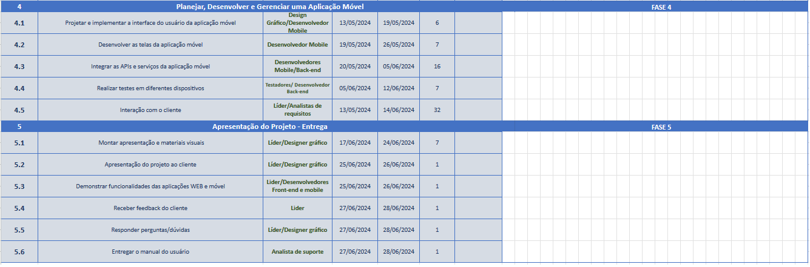
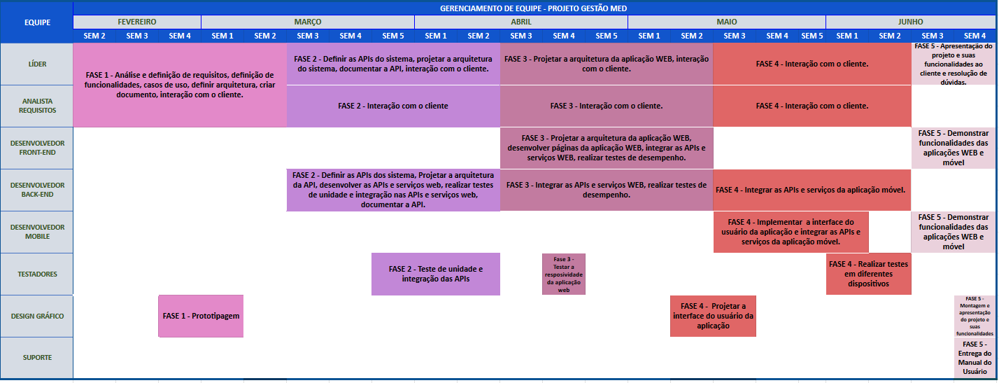
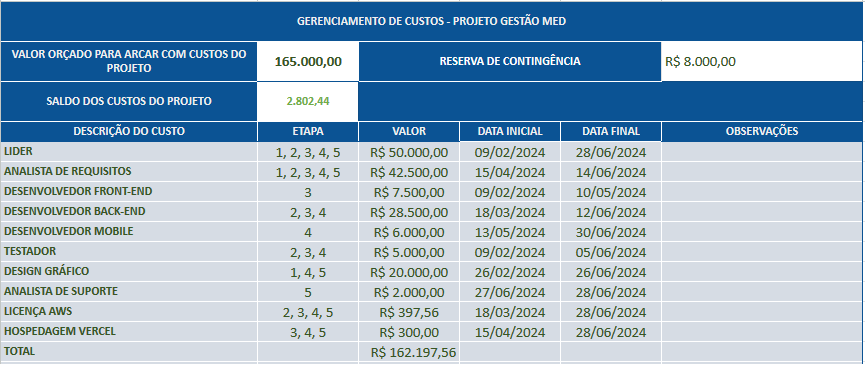

# Introdução

Com o progresso e a expansão da indústria farmacêutica após a Segunda Guerra Mundial, houve um notável avanço na fabricação de medicamentos. Paralelamente ao desenvolvimento do arsenal terapêutico, surgiram incidentes associados ao uso desses produtos (Mastroianni, Varallo, 2013).

A administração de medicamentos é uma tarefa complexa que afeta pessoas de todas as idades e condições de saúde. No entanto, é especialmente desafiador para os idosos ou aqueles com problemas cognitivos, que muitas vezes lidam com uma grande quantidade de medicamentos prescritos para diferentes tratamentos terapêuticos. Com o aumento da expectativa de vida e da prevalência de condições crônicas, a necessidade de soluções que auxiliem na administração correta de medicamentos torna-se cada vez mais iminente. 

No âmbito da medicina, a administração de medicamentos refere-se à ingestão precisa dos medicamentos conforme horários e dosagens indicados pelo profissional de saúde. Contudo, neste projeto, é adotado o conceito de administração pessoal de medicamentos para abranger não apenas o uso correto dos medicamentos, mas também a sua organização e manejo, desde a compra até a ingestão pelos usuários.

Conforme relatado por Patel e Zed (2002), complicações relacionadas à farmacoterapia representam uma parcela significativa das hospitalizações de emergência, variando entre 9% e 24%. Esses estudos também destacam que aproximadamente 70% desses problemas poderiam ser evitados com uma intervenção direta do farmacêutico no cuidado clínico (*apud* Conselho Federal de Farmácia, 2016).

O armazenamento de medicamentos nos domicílios é prática comum da população brasileira, podendo representar um potencial risco para o surgimento de agravos à saúde. Além disso, esses medicamentos são armazenados, frequentemente, em ambientes inadequados, propiciando diversas possibilidades de consumo irracional, incluindo medicamentos prescritos para doenças crônicas, analgésicos, antibióticos e anti-inflamatórios. (Milanez et al., 2010)

Com base nesse contexto, é proposto o desenvolvimento de uma aplicação *web* dedicada à organização e gestão da administração de medicamentos, visando facilitar  o dia a dia das pessoas que dependem da ingestão de medicamentos regularmente. 

## Problema

A organização pessoal de medicamentos emerge como uma tarefa complexa, especialmente para idosos com patologias crônicas. A diversidade de medicamentos a serem consumidos diariamente, em diferentes horários e doses, contribui para essa complexidade. A habilidade e a memória necessárias para o uso correto dos medicamentos podem ser comprometidas por uma série de fatores. Segundo Costa (2012), menos de 30% dos idosos utilizam suas medicações corretamente.

Entre os problemas mais comuns associados à administração de medicamentos estão o uso desnecessário ou incorreto de medicamentos, doses inadequadas e a não conformidade com os horários prescritos. Esses problemas podem resultar em efeitos adversos graves, exigindo intervenção médica (Manual do Cuidador da Pessoa Idosa, 2008).

Portanto, a administração de medicamentos afeta os usuários que precisam gerenciar administração de medicamentos. A complexidade aumenta quando múltiplos medicamentos devem ser administrados em várias pessoas, com horários variados. Sendo assim, este trabalho busca abordar os desafios enfrentados na administração de medicamentos, não apenas na terceira idade, mas em todas as faixas etárias, propondo uma solução prática e inovadora através do *design* de produto e do conhecimento em Sistema de Informações. 

## Objetivos

**Objetivo geral:**

O objetivo geral é promover o bem-estar dos usuários através de uma solução integrada para a gestão de medicamentos e acompanhamento da saúde, garantindo administração correta e segura dos medicamentos e melhorando a qualidade de vida de todos os envolvidos.

**Objetivos específicos:**

O objetivo é não apenas indicar o medicamento a ser ingerido, mas também fornecer informações sobre o horário correto de ingestão, quantidade e duração do tratamento, visando assim facilitar e tornar mais segura a administração de medicamentos para os usuários como também:

1. Desenvolver uma interface intuitiva e amigável que permita aos usuários cadastrarem informações sobre os medicamentos, incluindo nome, dosagem, horário de administração e duração do tratamento;
2. Criar um banco de dados completo contendo informações detalhadas sobre os medicamentos, como nome, substância ativa, dosagem e posologia;
3. Implementar funcionalidades de alerta e lembrete, utilizando notificações na tela do celular ou do *smartwatch*, para informar os usuários sobre os horários de administração dos medicamentos e alertar sobre a necessidade de compra caso um medicamento em uso esteja prestes a acabar no estoque do usuário;  
4. Integrar um sistema de organização dos medicamentos por dia e horário, proporcionando uma visualização clara e organizada do cronograma de administração;
5. Incluir ferramentas de acompanhamento e registro do histórico de administração de medicamentos, permitindo aos usuários monitorarem a adesão ao tratamento ao longo do tempo e compartilhar essas informações com seus médicos, caso desejem;
6. Implementar a funcionalidade de enviar esses dados através de um relatório para o médico, facilitando a comunicação entre paciente e profissional de saúde e auxiliando no acompanhamento do tratamento;
7. Garantir a segurança e privacidade dos dados dos usuários, implementando medidas robustas de proteção de informações pessoais e de saúde, em conformidade com as regulamentações de proteção de dados;
8. Disponibilizar suporte técnico e orientações para os usuários, visando esclarecer dúvidas e fornecer assistência na utilização do sistema, garantindo uma experiência satisfatória e segura para todos os envolvidos;
Esses objetivos visam não apenas facilitar e tornar mais seguro o processo de administração de medicamentos, mas também promover o acompanhamento e a gestão eficaz da saúde do usuário, integrando-o de forma mais completa ao sistema ou aplicativo.

## Justificativa

Este projeto surge da necessidade de simplificar a rotina daqueles que precisam administrar medicamentos diariamente, seja para si mesmos ou para outras pessoas. Conforme relatado pelo Conselho Regional de Enfermagem de São Paulo (COREN, 2017, p. 11), os incidentes relacionados a medicamentos (IRM) estão entre os mais comuns nos serviços de saúde, acarretando não apenas transtornos para os pacientes, mas também para seus familiares, amigos, cuidadores e profissionais de saúde.

O uso racional de medicamentos (URM) é fundamental para garantir o correto e apropriado uso dos medicamentos. Isso envolve fornecer ao paciente o medicamento adequado, na dose correta, pelo tempo necessário e ao menor custo possível. Todos os profissionais envolvidos na cadeia terapêutica - médicos, farmacêuticos, enfermeiros e até mesmo os próprios pacientes - desempenham papéis essenciais para promover o uso racional dos medicamentos (Mastroianni, Varallo, 2013).

Nesse contexto, a tecnologia assistiva surge como uma aliada importante, buscando promover a autonomia e independência das pessoas, especialmente aquelas com deficiência ou mobilidade reduzida. Terapeutas ocupacionais, fisioterapeutas, farmacêuticos e designers, entre outros profissionais, têm trabalhado no desenvolvimento e adaptação de produtos e recursos assistivos para atender às necessidades dos usuários.

Identificado esse problema como uma demanda mais ampla, surge a possibilidade de oferecer uma solução por meio do design de produto. Desta forma, propõe-se a criação desta aplicação *web* como uma ferramenta de auxílio na última etapa do processo de administração de medicamentos. 

## Público-Alvo

O público-alvo deste projeto abrange tanto pessoas que necessitam administrar medicamentos para si mesmas quanto cuidadores responsáveis pela gestão dos medicamentos de outras pessoas. Isso inclui:

1.Indivíduos de todas as faixas etárias que tem como idioma o português, que saibam ler, e que fazem uso regular de medicamentos para tratamento de doenças crônicas ou agudas;

2.Idosos que lidam com polifarmácia, ou seja, o uso simultâneo de múltiplos medicamentos.

# Especificações do Projeto

Nesta seção, serão abordados  os tópicos que norteiam o desenvolvimento desta aplicação *web*, que serão descritos a seguir.

## Personas

A descrição das personas trata-se de uma representação semi-fictícia, baseada em dados reais, do seu cliente ideal. É um modelo construído a partir de características comportamentais e demográficas.

**1.Joaquim Cardoso dos Santos** 

Joaquim Cardoso dos Santos, 46 anos, viúvo, tem 3 filhos. Atualmente mora sozinho no subúrbio de São Paulo, trabalha como operador de máquinas pesadas em grandes construções e é portador da Síndrome de Burnout (distúrbio psíquico causado pela exaustão extrema). Ultimamente seu psicólogo recomendou-lhe que utilizasse redes sociais para entretenimento, e praticasse exercícios físicos; então ele passou a utilizar frequentemente *WhatsApp*, *Facebook* e o *Instagram*; e faz uma curta caminhada no final da tarde todos os dias. Ele faz uso diário de antidepressivos e ansiolíticos para tratamento de seu distúrbio. Como o horário de sua medicação fica dentro do horário de trabalho ele acaba atrasando ou antecipando o uso dos medicamentos. Tendo isso em mente, ele está procurando por um artifício que possa lembrá-lo de se medicar no horário correto.

**2.Sueli Aparecida** 

Sueli Aparecida tem 70 anos, é professora aposentada e vive na companhia do marido que também é aposentado. Ela costuma utilizar algumas redes sociais como *WhatsApp* e *Facebook* para se relacionar com familiares e amigos. Faz uso regular de medicamentos para controle de diabetes, hipertensão arterial, dislipidemia e hipotireoidismo. Além disso, também toma algumas vitaminas para suplementação nutricional. Procura algum meio para auxiliá-la a organizar as informações, bem como para lembrá-la de tomar o medicamento certo, na hora certa e na dosagem correta, pois tem dificuldades com a bula, esquecimentos de horários, nome dos medicamentos, além de esquecer de verificar quando determinado medicamento está acabando.

**3.Adriana Pereira da Silva** 

Adriana Pereira Silva, 50 anos, é casada e mãe de três filhos. Ela trabalha como professora há quinze anos e há cinco anos foi diagnosticada com diabetes, hipertensão arterial além de ansiedade, e para controle dessas doenças faz uso de vários medicamentos. Em sua rotina, Adriana precisa controlar os horários e as doses dos remédios, necessitando assim de um auxílio tecnológico que a faça lembrar dos horários para que ela possa ter o controle das doses a administrar no dia.

**4.Mauro Gomes Teixeira**

Mauro Gomes Teixeira, 34 anos, é solteiro e mora sozinho. Ele é técnico de enfermagem e recentemente iniciou um tratamento medicamentoso para diabetes tipo II. Ao longo do seu dia ele toma 3 medicações diferentes e às vezes se esquece de tomá-las, além de se confundir se já as tomou ou não.  Com a vida corrida, ele se sente muitas vezes confuso com administração de seus medicamentos e acredita que uma ferramenta tecnológica em que ele pudesse ser avisado dos horários de administração, e em que poderia acompanhar como se medicou e quais medicações já tomou no dia, poderia auxiliá-lo nesse tratamento crônico.

## Histórias de Usuários

É uma explicação informal e geral sobre um recurso do sistema, escrita a partir da perspectiva do usuário final. Seu objetivo é articular como um recurso do sistema pode gerar valor para o cliente.

Com base na análise das personas foram identificadas as seguintes histórias de usuários:

|EU COMO... `PERSONA`| QUERO/PRECISO ... `FUNCIONALIDADE` |PARA ... `MOTIVO/VALOR`|
|--------------------|------------------------------------|-----------------------|
|Todos os usuários pacientes|Receber notificações com as instruções a hora do uso dos medicamentos.|Proporcionar que eu utilize o medicamento certo, na hora certa e na dose prescrita.|                   
|Sueli Aparecida  Usuário Paciente|Organizar as informações dos vários medicamentos que utilizo.|Viabilizar utilização segura e eficiente dos medicamentos.|        
|Sueli Aparecida  Usuário Paciente|Receber notificações 2 dias antes avisando quando determinado medicamento está acabando.|Evitar interrupções no tratamento e prejuízo à saúde.|
|Adriana Pereira  Usuário Paciente|Manter registro completo de todos os medicamentos já administrados durante o dia e ao longo do tratamento.|Manter o tratamento correto e eficiente.|
|Mauro Gomes  Usuário Paciente|Cadastrar todos os medicamenos a serem usados.|Não confundir suas medicações e horários de adminstração.|
|Joaquim Cardoso  Usuário Paciente|Gerar um relatório do histórico de tomada de medicamentos.|Acompanhar e partilhar com o médico como tomei os medicamentos.|

## Requisitos

Os requisitos funcionais se relacionam ao que o sistema faz, em termos de tarefas e serviços. Já os requisitos não funcionais se relacionam ao uso do sistema em termos de desempenho, usabilidade, confiabilidade, segurança, disponibilidade, manutenção e tecnologias envolvidas.
As tabelas a seguir apresentam os requisitos funcionais e não funcionais que detalham o escopo do projeto.

### Requisitos Funcionais

|ID    | Descrição do Requisito  | Prioridade |
|------|-----------------------------------------|----|
|RF-001| Permitir que o usuário cadastre tarefas | ALTA | 
|RF-002| Emitir um relatório de tarefas no mês   | MÉDIA |

### Requisitos não Funcionais

|ID     | Descrição do Requisito  |Prioridade |
|-------|-------------------------|----|
|RNF-001| O sistema deve ser responsivo para rodar em um dispositivos móvel | MÉDIA | 
|RNF-002| Deve processar requisições do usuário em no máximo 3s |  BAIXA | 

### Caso de Uso
| Casos de Uso | CdU01 - Criar conta  |
|------|------------------------------|
|Procedimento| 1) Usuário informa nome, sobrenome, e-mail, senha, Estado, Cidade, gênero, data de nascimento e clica no botão  "Criar usuário".  2) A aplicação verifica se os dados são válidos e informa ao usuário caso não estejam.  3) A aplicação armazena os dados e direciona o usuário para a tela de login.|
|Resultado esperado| Criação do usuário e redirecionamento para página de login. | 
|Dados de entrada |Nome, sobrenome, e-mail, senha, steado, cidade, gênero, data de nascimento. |

| Casos de Uso | CdU02 - Fazer login  |
|------|------------------------------|
|Procedimento| 1) Usuário informa e-mail, senha e clica em "entrar".           2) A aplicação verifica se os dados estão corretos e informa ao usuário caso não estejam.          3) A aplicação direciona o usuário para a sua página inicial.|
|Requisitos associados|Cadastro de usuário.|
|Resultado esperado| Redirecionamento para página home da aplicação. | 
|Dados de entrada |E-mail e senha. |

| Casos de Uso | CdU03 - Cadastrar  medicações e alarmes  |
|------|------------------------------|
|Procedimento| 1)O usuário acessa a página de cadastro de medicamentos.  2)O usuário informa o nome do medicamento, o estoque Inicial, o período de uso e  horários programados para alarme  e clica em adicionar.  3) A aplicação armazena os dados e direciona o usuário para a home da aplicação.|
|Requisitos associados|Cadastro de usuário e login.|
|Resultado esperado| O medicamento e horários programados para alarmes serão adicionados, e o usuário será redirecionado para página home. | 
|Dados de entrada |Nome do medicamento, o estoque Inicial, o período de uso e o horário de uso. |

| Casos de Uso | CdU04 - Consultar Histórico de Ingestão de Medicamentos |
|------|------------------------------|
|Procedimento| 1)O usuário seleciona a opção “Histórico de Ingestão”.  2) O aplicativo devolve uma interface para seleção de período de consulta do histórico como “Dia” “Semana” “Mês” e “Ano”.  3) O usuário seleciona o período desejado.  4) O sistema recupera e devolve o histórico de ingestão de medicamentos para o período selecionado.|
|Requisitos associados|Cadastro de usuário, login, cadastro de medicamentos.|
|Resultado esperado| O usuário terá acesso ao histórico de todos os medicamentos já tomados. | 
|Dados de entrada |Histórico de ingestão e dia, semana, mês e ano. |

| Casos de Uso | CdU05 - Editar medicamentos cadastrados. |
|------|------------------------------|
|Procedimento| 1) O usuário acessa a opção “Cadastrar Medicamentos”.  2)O usuário visualiza os medicamentos já cadastrados.  3) O usuário seleciona o medicamento que deseja editar.  4) O aplicativo exibe informações sobre o medicamento selecionado como nome, dosagem e horários de administração.  5) O usuário seleciona a opção que deseja alterar.  6) O usuário edita a opção selecionada e clicar na opção “Guardar Alteração”.  7) O aplicativo exibe uma mensagem informando que a alteração foi salva com sucesso. |
|Requisitos associados| Cadastro de usuário, login, cadastro de medicamentos. |
|Resultado esperado| O usuário realiza alterações das informações sobre medicamentos já cadastrados. | 
|Dados de entrada | Lista de medicamentos, informações sobre medicamento selecionado, alterações desejadas e confirmação de alteração. |

| Casos de Uso | CdU06 -  Confirmar ingestão de medicamento |
|------|------------------------------|
|Procedimento| 1) O usuário recebe um lembrete na tela do celular indicando o horário correto para a ingestão do medicamento, assim como as suas informações e a sua respectiva dosagem.  2) O usuário toca na notificação para abrir o aplicativo.  3) O aplicativo exibe os detalhes sobre o medicamento para qual o lembrete foi disparado.   4) O usuário confirma que tomou a medicação carregando no botão “Confirmar Ingestão”.   5) O aplicativo  confirma a ingestão do medicamento. |
|Requisitos associados| Cadastro de usuário, login, cadastro de medicamentos |
|Resultado esperado|Confirmação de ingestão de medicamento de forma manual. | 
|Dados de entrada | Recepção de lembrete, detalhes do medicamento e confirmação de ingestão de medicamento.|

| Casos de Uso | CdU07 -  Gerar relatório de medicamentos. |
|------|------------------------------|
|Procedimento| 1)O usuário acessa a opção “Gerar Relatório”.   2) O usuário seleciona os medicamentos que deseja incluir no relatório.   3) O aplicativo gera um relatório com as informações dos medicamentos selecionados e cria um arquivo em formato PDF.   4) O aplicativo  disponibiliza um link para o download do arquivo PDF.   5) O usuário descarrega o arquivo para envio ao médico. |
|Requisitos associados| Cadastro de usuário, login, cadastro de medicamentos |
|Resultado esperado| O usuário recebe um arquivo em formato PDF com um relatório de medicamentos após realizar o pedido de geração de relatório. | 
|Dados de entrada | Seleção de medicamentos, acesso ao Link para download do arquivo PDF e conexão à internet.  |

### Diagrama de Casos de Uso

## Restrições

As restrições são as situações que limitam o projeto, que podem ser impostas por alguém ou pelo próprio ambiente no qual o projeto está inserido. Elas podem comprometer a execução e o desenvolvimento dos trabalhos que compõem o projeto. 
O projeto está restrito pelos itens apresentados na tabela abaixo:

|ID| Restrição                                             |
|--|-------------------------------------------------------|
|01| O projeto deverá ser entregue até o final do primeiro semestre de 2024.|
|02| O projeto não deve extrapolar o orçamento definido.|
|03| A aplicação terá somente um tipo de usuário.|
|04| O desenvolvimento do projeto estará limitado a 6 colaboradores.|
|05| O projeto será desenvolvido apenas no idioma português.|
|06| A hospedagem back-end deve ser somente na AWS.|
|07| A hospedagem front-end será na plataforma Vercel.|
|08| Atividades no *web browser* serão restritas.|

# Catálogo de Serviços

O catálogo de serviços do projeto é uma ferramenta vital que delineia os serviços oferecidos, proporcionando clareza e transparência sobre as funcionalidades disponíveis. Com uma estrutura bem definida, o catálogo de serviços torna-se essencial para a gestão eficiente do projeto, auxiliando na tomada de decisões e na alocação adequada de recursos.

# Matriz de Rastreabilidade 

# Gerenciamento de Projeto

O gerenciamento de projetos é um conjunto de práticas, métodos e ferramentas utilizadas para coordenar os processos de um projeto de forma eficaz e atingir resultados. Ele serve para garantir que o projeto seja concluído com sucesso. Ou seja, que os resultados desejados sejam alcançados de acordo com as metas estabelecidas. 

## Gerenciamento de Tempo

**ETAPA 1: Documentação de Contexto** 

•	Análise e definição de requisitos do projeto.   •	Definição de funcionalidades do sistema.   •	Criação dos casos de uso e do diagrama de uso.   •	Definição da arquitetura do sistema.   •	Prototipagem.   •	Criação de documento com as informações e especificações do projeto.   •	Interação com o cliente.   

**ETAPA 2: Planejar, Desenvolver e Gerenciar APIs e Web Services** 

•	Definição das APIs do sistema.   •	Projeto da arquitetura da API.   
•	Desenvolvimento das APIs e serviços web.   •	Realização de testes de unidade e integração nas APIs e serviços web.   •	Documentação da API.   •	Interação com o cliente.   

**ETAPA 3: Planejar, Desenvolver e Gerenciar uma Aplicação Web** 

•	Projeto da arquitetura da aplicação *web*.   •	Desenvolvimento das páginas da aplicação *web*.   •	Integração das APIs e serviços *web*.   •	Testes de responsividade da aplicação *web*.   •	Testes de desempenho.   
•	Interação com o cliente.   

**ETAPA 4: Planejar, Desenvolver e Gerenciar uma Aplicação Móvel**

•	Projeto da interface do usuário da aplicação móvel.   •	Desenvolvimento das telas da aplicação móvel.   •	Integração das APIs e serviços da aplicação móvel.   •	Realização de testes em diferentes dispositivos.   
•	Interação com o cliente.   

**ETAPA 5: Apresentação** 

•	Montagem de apresentação e materiais visuais.   •	Apresentação do projeto ao cliente.   •	Demonstração da funcionalidade das aplicações *web* e móvel.   •	Recepção de *feedback* do cliente e responder a perguntas.   •	Entrega do manual do usuário.   

## Gerenciamento de Equipe

O gerenciamento adequado de tarefas contribuirá para que o projeto alcance altos níveis de produtividade. Por isso, é fundamental que ocorra a gestão de tarefas e de pessoas, de modo que os times envolvidos no projeto possam ser facilmente gerenciados. 

•	Distribuição de atividades e responsabilidades para a divisão eficiente do trabalho;   •	Comunicação diária rápida de 20 minutos para ajustes e retorno do andamento das atividades;   •	Reunião semanal para acompanhamento do andamento do projeto e abertura de discussões, além de *feedbacks* para aprimoramento contínuo.   

## Gerenciamento de Custos

Gerenciamento de custos em projetos é um conjunto de processos que tem por objetivo garantir que o projeto seja entregue dentro do orçamento aprovado. Dessa forma, é possível conciliar os recursos financeiros que o projeto precisa para ser concluído. Ele traz uma forma estruturada para planejar, estimar, determinar e controlar os custos. Dessa forma, garante que nenhuma etapa seja esquecida e proporciona a elaboração de um orçamento mais próximo da realidade.  

# Arquitetura da Solução

A arquitetura de *software* compreende a organização dos elementos de uma solução, junto ao ambiente de hospedagem. Inclui a estrutura do *software*, seus componentes e a infraestrutura para garantir seu funcionamento. Considerar aspectos técnicos e operacionais é crucial para desenvolver, implantar e manter aplicações robustas.

## Tecnologias Utilizadas

Ao desenvolver um projeto, a seleção das tecnologias desempenha um papel fundamental, definindo sua base e influenciando diretamente sua eficiência e funcionalidade. Abaixo estão as tecnologias inicialmente consideradas para a implementação da solução. No entanto, é importante ressaltar que essas escolhas podem ser ajustadas ao longo do processo de desenvolvimento, conforme novos *insights* e requisitos emergem.

- Linguagens de programação: *JavaScript* e *TypeScript*
- *Frameworks*: *React* *Native*
- Bibliotecas: *React* e *Redux*
- Ferramentas: *Visual Studio Code*, *Postman* e *Git*
- Banco de dados: *MySQL*
- Plataforma de tempo de execução: *Node.js*
- Hospedagem: Vercel e AWS

## Hospedagem

***Frontend* (aplicação *web*):** Vamos hospedar o frontend da nossa aplicação *web* na plataforma Vercel.

**Aplicativo móvel:** Para o aplicativo móvel, o *front-end* será incorporado diretamente no próprio aplicativo, eliminando a necessidade de hospedagem em nuvem.

***Backend*:** Para o *back-end*, iremos utilizar o *Amazon EC2 (Elastic Compute Cloud)* para hospedagem, garantindo escalabilidade e flexibilidade na infraestrutura.

**Base de dados:** Para a base de dados, optaremos pelo *Amazon RDS (Relational Database Service)* para hospedar nosso banco de dados *MySQL*. O *Amazon RDS* oferece um gerenciamento simplificado de bancos de dados relacionais, proporcionando facilidade de uso e manutenção.

# Referências Bibliográficas

Born, T. (Organizadora). (2008). Cuidar melhor e evitar a violência - Manual do cuidador da pessoa idosa. Brasília: Secretaria Especial dos Direitos Humanos, Subsecretaria de Promoção e Defesa dos Direitos Humanos. Disponível em: https://www.gov.br/mdh/pt-br/centrais-de-conteudo/pessoa-idosa/manual-do-cuidador-da-pessoa-idosa/view. Acesso em: 23 fev. 2024.

Conselho Federal de Farmácia. (2016). Serviços farmacêuticos diretamente destinados ao paciente, à família e à comunidade: contextualização e arcabouço conceitual. Brasília: Conselho Federal de Farmácia. Disponível em: https://www.cff.org.br/userfiles/Profar_Arcabouco_TELA_FINAL.pdf. Acesso em: 23 fev. 2024.

COREN - Conselho Regional de Enfermagem de São Paulo. (2017). Manual de Orientações para a Enfermagem: Incidentes Relacionados a Medicamentos (IRM). São Paulo, SP: COREN.  Disponível em: https://portal.coren-sp.gov.br/sites/default/files/uso-seguro-medicamentos.pdf Acesso em: 23 fev. 2024.

Costa, R. S. M. (2012). Arranjos domiciliares e a utilização de serviços de saúde dos idosos brasileiros [Dissertação de mestrado, Pós-graduação em Demografia, Faculdade de Ciências Econômicas, Universidade Federal de Minas Gerais]. Repositório Institucional UFMG. Disponível em:https://repositorio.ufmg.br/bitstream/1843/AMSA-97XNMF/1/roberta_stancioli_marinho_costa.pdf. Acesso em: 23 fev. 2024.

MASTROIANNI, Patricia; VARALLO, Fabiana R. Farmacovigilância para promoção do uso correto de medicamentos. Grupo A, 2013. E-book. ISBN 9788582710029. Disponível em: https://integrada.minhabiblioteca.com.br/#/books/9788582710029/.Acesso em: 23 fev. 2024.

Milanez, M. C., Stutz, E., Rosales, T. O., Penteado, A. J., Perez, E., Cruciol, J. M., Pereira, E. M., & Bovo, F. (2010). Avaliação dos estoques domiciliares de medicamentos em uma cidade do Centro-Sul do Paraná. Revista de Ciências Médicas e Biológicas, ISSN 1677-5090. Disponível em: https://repositorio.ufba.br/bitstream/ri/23088/1/3_v.12_3.pdf. Acesso em: 23 fev. 2024.
