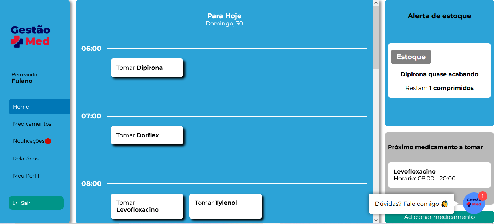
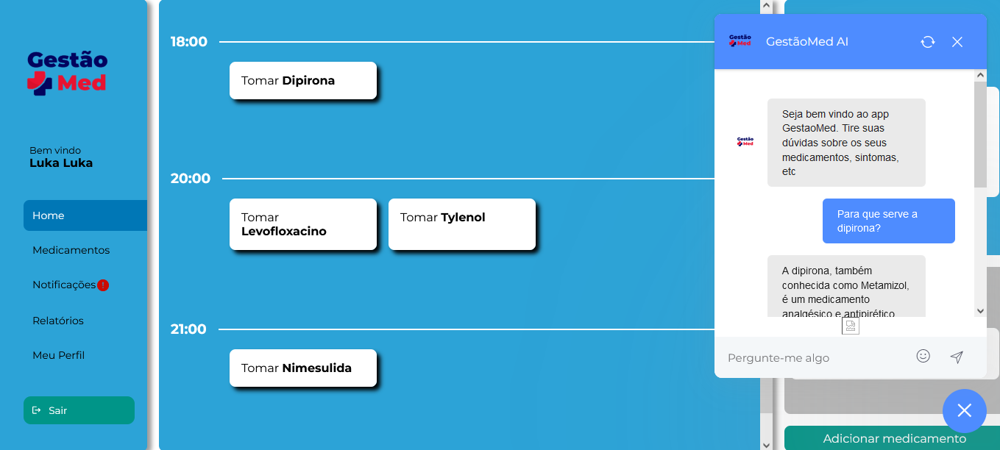
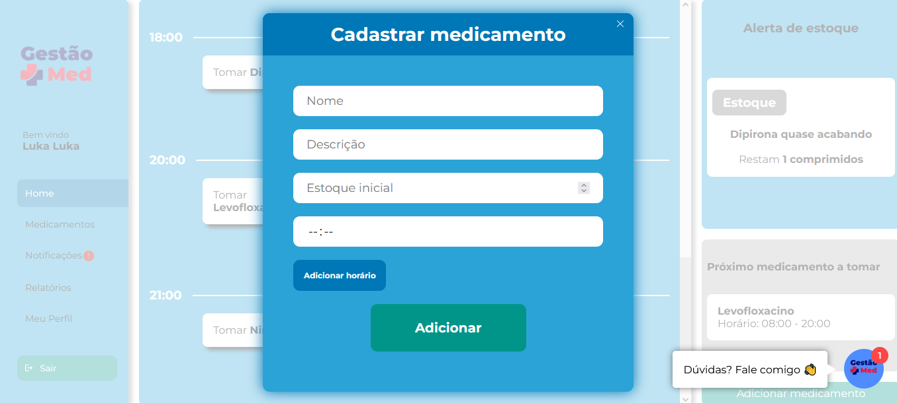
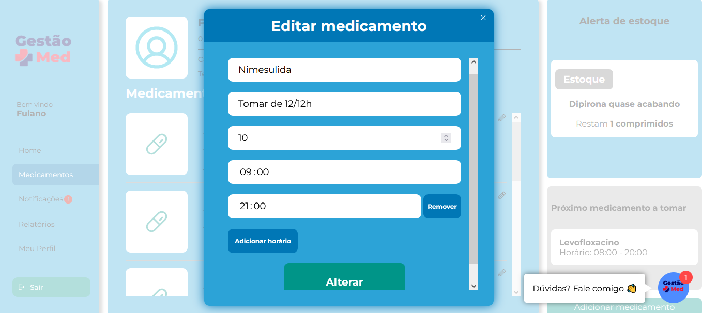
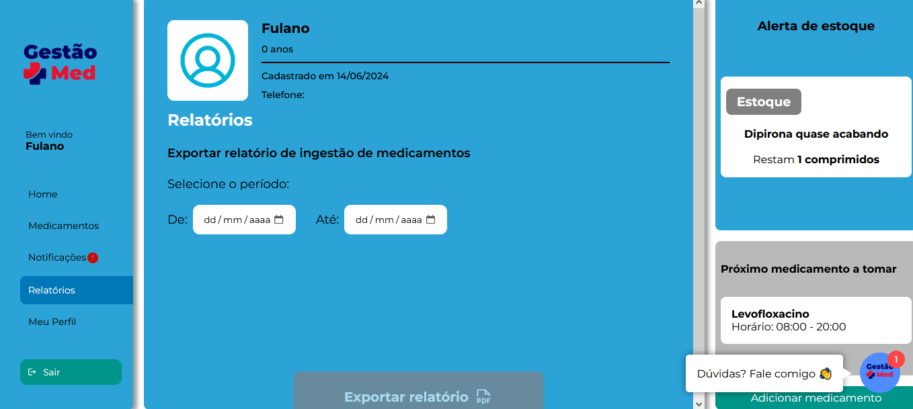

# Front-end Web

Gestão Med é uma aplicação desenvolvida para a organização e gestão da administração de medicamentos, visando facilitar o dia a dia das pessoas que dependem da ingestão de medicamentos regularmente.  O objetivo é promover o bem-estar dos usuários através de uma solução integrada para a gestão de medicamentos e acompanhamento da saúde, garantindo administração correta e segura dos medicamentos e melhorando a qualidade de vida de todos os envolvidos.

## Tecnologias Utilizadas

NEXTJS 14 TS  
HTML  
CSS (Cascading Style Sheets)  
JavaScript

## Arquitetura

O Front end é o componente com o qual o usuário interage. O front end fornece uma interface de usuário amigável para cadastrar os usuários e os medicamentos, editar medicamentos, entre outras funcionalidades. Ele envia solicitações à API web para que o alerta de horário de tomada do medicamento seja disparado como um alarme por meio de tela de alerta, no horário cadastrado para a tomada do medicamento.

## Modelagem da Aplicação

## Projeto da Interface Web

### Protótipos

**Tela de Login** 

**Tela de cadastro de usuário**

**Tela home**

**Tela chatbot** 

**Tela perfil**

**Tela de cadastro de medicamentos**

**Tela de edição de medicamentos**

**Tela de medicamentos**

**Tela de exportar relatório**

### Design Visual

- Paleta de Cores  
Optamos por uma paleta predominante de tons azuis para o front end para proporcionar uma experiência de usuário agradável pois o azul é uma cor associada à tranquilidade, calma, confiança. A cor primária tem o código #2CA3D7.  

- Tipografia 
A fonte principal usada no corpo do texto é "Roboto”. A fonte é legível e possui uma aparência moderna.

- Botões 
Os botões na interface têm bordas arredondadas e prevalência na cor de fundo verde (#009588) com texto em branco para criar um contraste com o fundo escuro e facilitar a leitura para o usuário.

- Campos 
Os campos de preenchimento de texto têm bordas arredondadas e uma cor de fundo branca que contrasta com os textos de instrução de escrita na cor cinza, código #A5A5A5.

### Layout Responsivo

O desenvolvimento do front end responsivo tem como parte essencial a adaptação da interface do projeto para diferentes tamanhos de tela e dispositivos. Seguem abaixo maneiras de adaptação da interface:  

- Media Queries: Utilizaremos media queries em nosso CSS para aplicar estilos específicos com base na largura da tela. Isso permite a personalização de estilos, como alterar o tamanho das fontes, reorganizar os elementos na página e ocultar ou exibir certos conteúdos com base na resolução da tela. 

- Layout Flexível: O layout da página será projetado com unidades flexíveis, como porcentagens, em vez de unidades fixas, como pixels. Isso permite que os elementos da página se ajustem dinamicamente ao tamanho da tela, preenchendo o espaço disponível de forma adequada.  

- Menu de Navegação Adaptável: Em dispositivos móveis e tablets, podemos substituir o menu de navegação tradicional por um menu de hambúrguer, economizando espaço na tela e tornando a navegação por toque mais fácil.  

- Imagens Responsivas: As imagens serão configuradas para serem responsivas. Isso significa que as imagens se redimensionarão automaticamente para se ajustar ao tamanho da tela, economizando largura de banda e melhorando o desempenho. 

- Fontes Flexíveis: O tamanho e o estilo das fontes também serão ajustados para garantir que o texto seja legível em diferentes dispositivos. Usaremos unidades relativas, como "em" e "rem", para manter a consistência.  

- Testes em Múltiplos Dispositivos: A interface será testada em uma variedade de dispositivos e tamanhos de tela, desde smartphones até monitores de alta resolução. Isso ajuda a identificar problemas e garantir que a experiência do usuário seja otimizada em todos os contextos. 

- Componentes Interativos: Elementos interativos, como botões e caixas de entrada, serão dimensionados e espaçados adequadamente para garantir que sejam fáceis de usar em telas sensíveis ao toque e com dispositivos de entrada variados. 

### Interações do Usuário

O projeto foi desenvolvido com o objetivo de oferecer uma experiência prática, permitindo que pessoas de todas as idades realizem facilmente os cadastros do usuário e de medicamentos a serem tomados, além de gerarem relatórios envolvendo o histórico de ingestão de medicamentos. É esperado que o alarme retornado pelo sistema também seja compreendido facilmente.

## Fluxo de Dados

1.	O usuário fornecerá dados para cadastro do usuário e posteriormente do cadastro do medicamento. O cliente solicitará uma requisição via HTTPS utilizando o método POST / registerUser  e registerMedicate  para ambas funcionalidades; 
2.	A API receberá os dados do lado do cliente e irá validá-los antes de enviar ao banco de dados Postgres;  
3.	Após o registro no banco de dados, a API retornará com a resposta com o status 201, caso os cadastros sejam realizados com sucesso; 
4.	Após o retorno da API, o usuário terá seu perfil cadastro e será capaz de visualizar o medicamento registrado em sua tela de acesso.

## Requisitos Funcionais

|ID    | Descrição do Requisito  | Prioridade |
|------|-----------------------------------------|----|
|RF-001| Gerenciar usuário paciente | ALTA |
|RF-002| Fazer *login*  | ALTA |
|RF-003| Gerenciar medicamentos | ALTA |
|RF-004| Disparar alerta de fim de estoque de medicamentos, onde a quantidade mínima para o disparo do alerta é de 2 medicamentos | ALTA |
|RF-005| Pesquisar informações de saúde e medicamentos por meio de inteligência artificial| MÉDIA |
|RF-006| Permitir que o paciente confirme a ingestão ao ser notificado | MÉDIA |

## Requisitos Não Funcionais

|ID     | Descrição do Requisito  |Prioridade |
|-------|-------------------------|----|
|RNF-001| O sistema atenderá ao requisito de **PORTABILIDADE** - deverá executar em browsers chrome 64+, edge 79+, fireforx 67+, opera 51+, safari 12+| ALTA |
|RNF-002| O sistema atenderá a Lei de Geral de Proteção de Dados pessoais nº 13.709/2018 | ALTA |
|RNF-003| O sistema deverá atender ao requisito de **USABILIDADE** - facilidade no uso do sistema, com 3 cliques máximos para alcançar a função | ALTA |
|RNF-004| O sistema deverá atender ao requsiito de **CONFIABILIDADE** - terá alta disponibilidade 99% do tempo | ALTA |
|RNF-005| O sistema deverá usar arquitetura em camadas para desacoplamento | MÉDIA |
|RNF-006| O *Layout* do sistema deverá usar *design* responsivo, para que renderize bem em qualquer tela a partir de 14 polegadas | MÉDIA |
|RNF-007| O sistema deverá processar requisições do usuário em no máximo 3s | BAIXA |

## Considerações de Segurança

A segurança é um ponto crítico para a garantia da integridade e confiabilidade do funcionamento da aplicação. Seguem algumas considerações de segurança relacionadas ao front-end: 

- Autenticação e autorização da api com criação do token JWT.  
- Validação de dados de entrada retornando campos cuidadosamente avaliados.

## Implantação

A implantação do front end exige criar um projeto na Vercel, importando o repositório do github relacionado ao projeto desejado. É necessário inserir as variáveis de ambiente que o projeto exige e que estão listadas abaixo, e depois fazer o deploy da aplicação no ambiente escolhido, seguindo as instruções específicas da Vercel. 

Variáveis de ambiente: 
- AUTH_URL=http://localhost:3000/api/auth  
- AUTH_SECRET=testsecret  
- JWT_SECRET=secretjwt  
- BASE_URL=http://localhost:3333.

## Testes

**1 - Preparação dos Casos de Teste** 

1.1. Os casos de testes incluem a validação de todos os casos de uso, de acordo com a regra de negócio, verificando se as requisições atendem ao desejado. 

1.2. Com base nos requisitos de negócio identificados, foram criados casos de teste que cobriram todos os cenários possíveis, incluindo casos de sucesso e casos de erro.

**2 – Testes**  

**2.1 Testes Unitários** 

  •	Objetivo: Validar unidades individuais de código, como funções, métodos e classes, para garantir que cada parte isolada funcione conforme o esperado. 
 
  •	Caso de teste: 
    o	Teste de validação: testa se as entradas de dados são validadas corretamente. 
    o	Teste de modelo: verifica se um modelo de usuário salva e recupera os dados corretamente. 
    o	Teste de serviço: verifica se um serviço de autenticação valida corretamente as credenciais.  
    o	Testes de API: verifica se um endpoint de criação de usuário cria um usuário corretamente.  
    
**2.2  Testes de integração** 

  •	Objetivo: Verificar a interação correta entre diferentes componentes ou módulos da aplicação. 
  
  •	Caso de teste: 
    o	Testes de Integração de API: Testar se uma chamada de API para criar um usuário também atualiza corretamente o banco de dados e retorna a resposta esperada. 
    o	Testes de Integração de Banco de Dados: Testar se a criação de um registro de usuário atualiza as tabelas relacionadas corretamente. 
    o	Testes de Integração de Frontend e Backend: Testar se um formulário de login no frontend envia a requisição correta ao backend e processa a resposta adequadamente. 

**2.3 Casos de testes** 
  
  **2.3.1 - Requisitos Funcionais**
   
   **Gerenciar Usuários** 
   
  Cadastro 
 • Clicar em criar conta na tela de login. 
 • Preencher os campos: nome, sobrenome, e-mail, senha e confirmação de senha. 
 • Clicar em Criar Usuário, para verificar se a aplicação é bem-sucedida caso os dados sejam válidos, ou se dá erro caso os dados sejam inválidos.  
  
  Edição 
  • Clicar em meu perfil. 
  • Fazer os ajustes necessários. 
  • Clicar em editar. 
  
  **Autenticação de Usuários** 
  
  •	Preencher as credenciais (e-mail e senha). 
  •	Verificar se o login é bem-sucedido ou não, clicando em entrar. 

  **Gerenciar Medicamentos**  
 
  Cadastro 
  •	Selecionar a opção adicionar medicamento que fica na home da aplicação. 
  •	Preencher os campos: nome do medicamento, estoque inicial, descrição e horários programados para alarme. 
  •	Clicar no botão adicionar.  
  •	O modal deverá fechar e então aparece a mensagem de sucesso do cadastro. 
  
  Edição 
  •	Na página home, selecionar medicamentos e lá clicar no ícone do lápis para a realizar a edição do respectivo medicamento. 
  •	Ao abrir o modal, fazer a edição desejada. 
  •	Clicar no botão alterar. 
  
  **Confirmar ingestão de medicamento** 
  
  • Na página home, clicar no nome do medicamento no seu respectivo horário de tomada para validar a ingestão do medicamento. 
  
  **Gerar relatório de ingestão de medicamentos** 
  
  •	Na página home, selecionar a opção relatórios 
  •	Selecionar o período desejado (dia, semana, mês, ano), onde será retornado o histórico de ingestão de medicamento desse período. 
  •	Clicar em exportar relatório. 
  •	O relatório deverá será exportado em .pdf. Caso não tenha registros no período, uma mensagem de que não há registros para o período deverá aparecer. 

**2.3.2 Requisitos Não Funcionais**

  **Portabilidade** 
  •	Testar a responsividade em diferentes dispositivos e tamanho de tela. 
  •	Avaliar a navegabilidade do usuário. 

  **Segurança** 
  •	Testar a aplicação contra Injeção SQL. 
  •	Verificar a proteção contra ataques de XSS e CSRF. 
  •	Testar a sobrecarga do sistema contra ataques DDOs. 
  
  **Desempenho** 
  •	Medir o tempo de resposta para operações críticas sob carga normal. 
  •	Testar a estabilidade da aplicação durante picos de carga. 
  
  **Usabilidade** 
  •	Testar a facilidade de aprendizado do sistema. 
  •	Testar a eficiência de uso da aplicação. 

  **Confiabilidade** 
  •	Testar a disponibilidade referindo-se ao tempo em que o sistema está acessível aos usuários. 
  •	Verificar a capacidade do sistema de continuar operando corretamente mesmo diante de falhas ou condições adversas. 
  •	Testar a habilidade do sistema de se recuperar rapidamente e eficientemente após uma falha. 

# Referências

GANDEE, Todd; AQUINO, Chris. Front-End Web Development: The Big Nerd Ranch Guide. Big Nerd Ranch Guides (O’Reilly). ISBN: 9780134432595. 
Entendendo Next.js e aplicando suas funcionalidades. Em: https://blog.geekhunter.com.br/o-que-e-next-js/ 
Next.js on Vercel. Em: https://vercel.com/docs/frameworks/nextjs 

